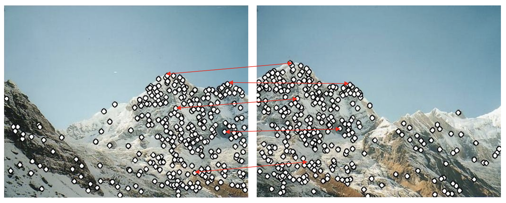

# SIFT
Implementation of scale-invariant feature transform(SIFT)

## Description
This repository contains implemetation of the SIFT:
1. Keypoint Detector
2. Descriptor
     
It is done by using only _numpy_ features and _opencv_ read/write methods.
     
Keypoint detector is a method, which implements several stages of finding
extremum points and their filtering.     
Filters:
1. Contrast filter;
2. Shift filter;
3. Edge filter.
## Environment
To setup environment, please install required python packages:
```python3
pip install -r requirements.txt
```

## Run example:
You can test this repository by compute one image:
```python3
python3 main.py
```
or to evaluage this pipeline with the different datasets to get their accuracy:
```python3
python3 evaluation.py
```
